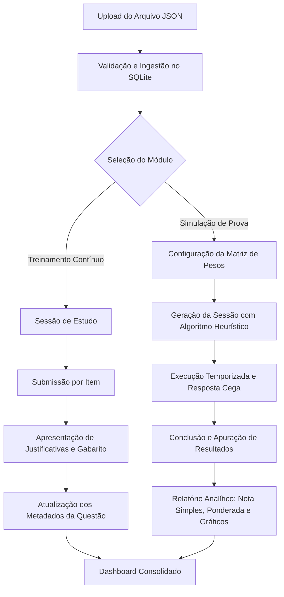

# CardsConcurso

Ambiente local para treinamento, resolução de questões e execução de simulados voltados a concursos públicos. Desenvolvido sob arquitetura *local-first*, eliminando dependências de serviços externos, telemetria de terceiros e restrições de conectividade de rede.

---

## 1. Objetivo do Sistema

O objetivo do CardsConcurso é fornecer um motor de avaliação e retenção cognitiva para candidatos a concursos públicos, combinando:

1. **Feedback Imediato (Active Recall)**: Resolução orientada a assertivas com comentários analíticos e justificativas fundamentadas para fixação teórica.
2. **Simulação Fidedigna de Exame**: Criação de cadernos de prova cronometrados com suporte a matriz de pesos por disciplina e apuração de nota ponderada.
3. **Otimização de Retenção (Spaced Retrieval)**: Algoritmo heurístico de seleção de questões baseado em distância de dificuldade alvo, histórico de erros e decaimento temporal de acesso.
4. **Soberania e Portabilidade de Dados**: Armazenamento relacional embarcado no sistema de arquivos local sem sincronização forçada ou paywalls de acesso.

---

## 2. Arquitetura e Descrição Funcional

O sistema é construído sobre o ecossistema Next.js com React Server Components (RSC) e Server Actions, conectado a uma base de dados relacional embarcada SQLite.

### 2.1. Modos de Operação

#### Modo Estudo (`/estudo`)
- **Objetivo**: Fixação incremental e aprendizado contínuo.
- **Funcionamento**: O usuário seleciona um tópico ou conjunto global, define a quantidade de questões e a dificuldade nominal (escala de 1 a 10).
- **Mecanismo de Resposta**: Validação síncrona com exibição imediata do gabarito definitivo e das justificativas individuais de cada alternativa.
- **Temporização**: Sem restrição de tempo decorrido.

#### Modo Simulado (`/simulado`)
- **Objetivo**: Avaliação somativa e calibração de tempo sob pressão de prova.
- **Matriz de Configuração**: Permite compor a estrutura da prova definindo para cada disciplina:
  - Quantidade nominal de questões (`questionCount`);
  - Peso ponderador da matéria (`weight`);
  - Dificuldade alvo esperada (`targetDifficulty`).
- **Execução e Persistência**:
  - Cronômetro progressivo em execução contínua;
  - Gabarito oculto até o encerramento formal da sessão;
  - Persistência assíncrona de estado por questão no banco de dados (`session_answers`), viabilizando recuperação de sessão em caso de interrupção ou recarregamento.
- **Relatório Pós-Sessão**:
  - Apuração de acertos, erros e questões em branco;
  - Cálculo de Desempenho Simples ($Nota_{simples}$);
  - Cálculo de Desempenho Ponderado ($Nota_{ponderada}$);
  - Segmentação analítica por disciplina com visualização gráfica;
  - Acesso irrestrito ao gabarito comentado para auditoria de desempenho.

---

### 2.2. Algoritmo de Seleção e Heurística de Questões

A composição das baterias de questões utiliza uma função de pontuação determinística que avalia o acervo disponível para cada categoria. Para uma dada questão $q$ e uma dificuldade alvo $d_{target} \in [1, 10]$:

$$\text{Score}(q) = S_{dificuldade}(q) + S_{erro}(q) + S_{tempo}(q)$$

Onde:
1. **Gradiente de Dificuldade**:
   $$S_{dificuldade}(q) = \max(0, 10 - |d_q - d_{target}|)$$
2. **Priorização de Erros Anteriores**:
   $$S_{erro}(q) = \begin{cases} 15, & \text{se } \text{last\_result} = 0 \text{ (última resposta incorreta)} \\ 0, & \text{caso contrário} \end{cases}$$
3. **Decaimento Temporal de Acesso (Curva de Retenção)**:
   $$S_{tempo}(q) = \begin{cases} 5, & \text{se } \text{last\_accessed\_at} \text{ for nulo (questão inédita)} \\ \min(10, \Delta_{dias}), & \text{onde } \Delta_{dias} = \frac{t_{atual} - t_{acesso}}{86400000} \end{cases}$$

O conjunto resultante é ordenado de forma decrescente por `Score(q)` com fator estocástico randômico para desempate, selecionando as $N$ primeiras tuplas para a sessão.

---

### 2.3. Fórmulas de Pontuação e Métricas

Na conclusão de um simulado composto por questões $i \in \{1, \dots, n\}$, associadas ao peso de sua categoria $w_i \in \mathbb{R}^+$ e resultado booleano $R_i \in \{0, 1\}$:

- **Desempenho Bruto (Simples)**:
  $$P_{simples} = \left( \frac{\sum_{i=1}^{n} R_i}{n} \right) \times 100$$

- **Desempenho Ponderado**:
  $$P_{ponderado} = \left( \frac{\sum_{i=1}^{n} (R_i \cdot w_i)}{\sum_{i=1}^{n} w_i} \right) \times 100$$

---

## 3. Modelo de Dados Relacional (Schema SQLite)

O banco de dados utiliza o motor SQLite (`database.sqlite`) com verificação estrita de chaves estrangeiras ativada (`PRAGMA foreign_keys = ON`).

```sql
CREATE TABLE categories (
  id INTEGER PRIMARY KEY AUTOINCREMENT,
  name TEXT NOT NULL UNIQUE
);

CREATE TABLE questions (
  id INTEGER PRIMARY KEY AUTOINCREMENT,
  category_id INTEGER NOT NULL,
  statement TEXT NOT NULL,
  difficulty INTEGER NOT NULL CHECK(difficulty >= 1 AND difficulty <= 10),
  last_accessed_at DATETIME,
  last_result BOOLEAN,
  FOREIGN KEY (category_id) REFERENCES categories(id) ON DELETE CASCADE
);

CREATE TABLE options (
  id INTEGER PRIMARY KEY AUTOINCREMENT,
  question_id INTEGER NOT NULL,
  text TEXT NOT NULL,
  is_correct BOOLEAN NOT NULL,
  justification TEXT,
  FOREIGN KEY (question_id) REFERENCES questions(id) ON DELETE CASCADE
);

CREATE TABLE presets (
  id INTEGER PRIMARY KEY AUTOINCREMENT,
  name TEXT NOT NULL,
  config TEXT NOT NULL
);

CREATE TABLE sessions (
  id INTEGER PRIMARY KEY AUTOINCREMENT,
  mode TEXT NOT NULL CHECK(mode IN ('simulado', 'estudo')),
  status TEXT NOT NULL DEFAULT 'em_andamento' CHECK(status IN ('em_andamento', 'concluido')),
  current_question_index INTEGER DEFAULT 0,
  time_elapsed_seconds INTEGER DEFAULT 0,
  total_questions INTEGER NOT NULL,
  config TEXT,
  created_at DATETIME DEFAULT CURRENT_TIMESTAMP,
  updated_at DATETIME DEFAULT CURRENT_TIMESTAMP
);

CREATE TABLE session_answers (
  id INTEGER PRIMARY KEY AUTOINCREMENT,
  session_id INTEGER NOT NULL,
  question_id INTEGER NOT NULL,
  is_correct BOOLEAN,
  time_spent_seconds INTEGER DEFAULT 0,
  FOREIGN KEY (session_id) REFERENCES sessions(id) ON DELETE CASCADE,
  FOREIGN KEY (question_id) REFERENCES questions(id) ON DELETE CASCADE
);
```

---

## 4. Filosofia Local-First e Justificativa Arquitetural

A decisão de projetar a solução como aplicação local autônoma obedece aos seguintes princípios de engenharia:

1. **Privacidade e Governança Estrita**: O histórico de desempenho, logs de sessão e cadernos de estudo pertencem unicamente ao usuário. Nenhum metadado é despachado para infraestrutura externa ou serviços analíticos.
2. **Latência de Acesso Zero (Edge Computation)**: A comunicação entre a interface do Next.js e o driver `better-sqlite3` opera no mesmo barramento do sistema operacional, provendo leituras e gravações transacionais na ordem de microssegundos.
3. **Resiliência e Operação Offline**: A plataforma não possui nós de rede como pontos únicos de falha. Opera continuamente em ambientes com conectividade restrita ou inexistente.
4. **Isenção de Custos Recorrentes e Lock-in**: Não há custos de infraestrutura de nuvem repassados, limites artificiais de requisições por segundo ou travas funcionais.
5. **Facilidade de Backup e Recuperação (Snapshot Atômico)**: O estado completo da aplicação é encapsulado em um único arquivo binário (`database.sqlite`). Operações de replicação, backup a quente ou transferência entre ambientes reduzem-se à cópia simples do arquivo físico.

---

## 5. Fluxo de Uso do Sistema



1. **Ingestão**: Carregamento de pacotes estruturados de questões em formato JSON via interface gráfica (`/questoes`).
2. **Parametrização**: Definição da matriz de pesos, distribuição de questões e níveis de dificuldade.
3. **Execução**:
   - Resolução iterativa com cálculo imediato de feedback no Modo Estudo;
   - Resolução sequencial cronometrada sob estado cego no Modo Simulado.
4. **Inspeção Analítica**: Avaliação estatística no Dashboard e auditoria detalhada de assertivas.

---

## 6. Stack Tecnológico

| Camada | Tecnologia | Propósito / Justificativa |
| :--- | :--- | :--- |
| **Framework Base** | Next.js (App Router) | Renderização no servidor, Server Actions tipadas e divisão inteligente de bundles. |
| **Linguagem** | TypeScript / Node.js | Tipagem estática fim a fim, mitigando divergências contratuais entre banco e view. |
| **Camada de UI** | React | Modelagem de interface declarativa e componentizada. |
| **Armazenamento** | SQLite via `better-sqlite3` | Driver síncrono C++ de alta performance para SQLite, garantindo ACID compliance e integridade referencial. |
| **Estilização** | CSS Modules (Vanilla CSS) | Estilização escopada com zero dependências externas em tempo de execução e performance ideal de renderização. |
| **Visualização de Dados** | Recharts | Renderização de gráficos SVG declarativos e responsivos baseados em dados de sessão. |
| **Iconografia** | Lucide React | Conjunto vetorial padronizado de ícones para navegação e status. |
| **Execução de Scripts** | TSX | Executor TypeScript nativo para scripts operacionais e migrations sem etapa de build prévio. |

---

## 7. Especificação do Contrato de Importação (JSON Schema)

O importador espera um array de objetos em formato JSON. Abaixo está a especificação das tipagens em TypeScript e a representação de dados compatível:

### 7.1. Definição TypeScript dos Tipos

```typescript
export interface ImportOption {
  text: string;
  is_correct: boolean;
  justification?: string;
}

export interface ImportQuestion {
  category: string;
  statement: string;
  difficulty: number; // Intervalo inteiro: 1 a 10
  options: ImportOption[];
}
```

### 7.2. Exemplo de Payload Válido

```json
[
  {
    "category": "Direito Constitucional",
    "statement": "Segundo o art. 5º da CF/88, a manifestação do pensamento é livre, sendo vedado o anonimato.",
    "difficulty": 3,
    "options": [
      {
        "text": "Certo",
        "is_correct": true,
        "justification": "O art. 5º, inciso IV da Carta Magna assegura a livre manifestação do pensamento, vedando expressamente o anonimato."
      },
      {
        "text": "Errado",
        "is_correct": false,
        "justification": "A assertiva reproduz fielmente a redação do inciso IV do art. 5º da CF/88."
      }
    ]
  },
  {
    "category": "Língua Portuguesa",
    "statement": "Identifique a oração em que a concordância verbal está em estrita conformidade com a norma-padrão:",
    "difficulty": 6,
    "options": [
      {
        "text": "Fazem dez anos que não visito a cidade.",
        "is_correct": false,
        "justification": "O verbo fazer indicando tempo decorrido é impessoal, devendo permanecer na 3ª pessoa do singular (Faz dez anos)."
      },
      {
        "text": "Haviam muitos candidatos inscritos no processo seletivo.",
        "is_correct": false,
        "justification": "O verbo haver com sentido de existir é impessoal e não flexiona para o plural (Havia muitos candidatos)."
      },
      {
        "text": "Trata-se de questões de extrema complexidade.",
        "is_correct": true,
        "justification": "Com o pronome 'se' como índice de indeterminação do sujeito, o verbo transitivo indireto permanece no singular."
      }
    ]
  }
]
```

### Campos do Objeto:
- `category` *(string)*: Nome da matéria/disciplina (criada automaticamente caso ainda não exista no banco).
- `statement` *(string)*: Enunciado completo da questão.
- `difficulty` *(número de 1 a 10)*: Nível de dificuldade estimado.
- `options` *(array)*: Lista com as opções de resposta:
  - `text` *(string)*: Texto da alternativa.
  - `is_correct` *(boolean)*: `true` para o gabarito correto e `false` para as incorretas.
  - `justification` *(string, opcional)*: Explicação ou fundamentação legal/doutrinária da alternativa.

---

### Pré-requisitos
- Node.js (versão 18.0.0 ou superior);
- Gerenciador de pacotes NPM.

### Procedimento de Instalação

1. Obtenha as dependências do projeto:
   ```bash
   npm install
   ```

2. Inicialize o esquema do banco de dados (criação de índices e tabelas com chaves estrangeiras):
   ```bash
   npx tsx src/lib/run-setup.ts
   ```

3. Inicie o servidor em modo de desenvolvimento:
   ```bash
   npm run dev
   ```

4. Acesse o sistema através do endpoint padrão:
   ```text
CardsConcurso/
├── src/
│   ├── actions/          # Server Actions (gestão de sessões, importação, estatísticas)
│   ├── app/              # Estrutura de rotas do Next.js (App Router)
│   │   ├── estudo/       # Páginas de setup e execução do Modo Estudo
│   │   ├── questoes/     # Gerenciamento de disciplinas e importador JSON
│   │   ├── simulado/     # Páginas de setup, execução e relatório do Modo Simulado
│   │   ├── layout.tsx    # Layout global com Sidebar
│   │   └── page.tsx      # Dashboard estatístico principal
│   ├── components/       # Componentes de interface (tabelas de peso, runners, gráficos)
│   └── lib/              # Configuração e inicialização do SQLite (db.ts, setup.ts)
├── database.sqlite       # Banco de dados local com todas as questões e sessões
└── package.json          # Dependências e scripts do projeto
```
