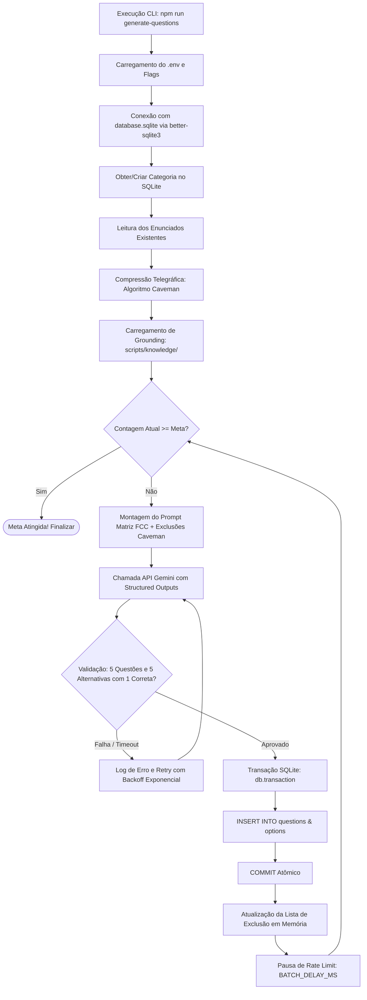

# Módulo de Geração e Ingestão de Questões (CLI)

Utilitário de linha de comando (*CLI*) de alto desempenho para geração direcionada, validação sintática estrita e ingestão transacional de questões de concurso público no banco de dados SQLite local (`database.sqlite`), integrado à API do Google Gemini com *Structured Outputs*.

---

## 1. Objetivo do Módulo

O objetivo deste utilitário é automatizar a expansão contínua do acervo de questões do **CardsConcurso**, calibrando as assertivas especificamente para o concurso do **TCE-GO (Tribunal de Contas do Estado de Goiás)** sob a régua de complexidade da banca **FCC (Fundação Carlos Chagas)**.

### Pilares de Engenharia
1. **Fidelidade de Banca (FCC Pattern)**: Enunciados com casos práticos e hipotéticos situados na rotina de fiscalização, governança pública e tecnologia do TCE-GO, com 5 alternativas homogêneas e distratores sofisticados.
2. **Grounding no Edital e Provas Reais**: Ingestão de conhecimento prévio (`scripts/knowledge/`) extraído dos editais oficiais e cadernos de prova anteriores.
3. **Anti-Duplicação Semântica com Compressão Caveman**: Mecanismo em memória que resume questões já existentes em termos telegráficos, impedindo questões redundantes e reduzindo em até 75% o consumo de tokens na lista de exclusão.
4. **Integridade Transacional (ACID)**: Gravação via `better-sqlite3` encapsulada em transações atômicas (`BEGIN TRANSACTION` / `COMMIT` / `ROLLBACK`). Nenhum lote parcial ou corrompido é persistido em caso de falha.
5. **Respeito a Rate Limits (Micro-Lotes)**: Fracionamento estrito em micro-lotes de 5 questões com temporização controlada (`sleep`) e retentativas com *exponential backoff*.

---

## 2. Arquitetura e Fluxo de Execução



---

## 3. Estrutura de Arquivos do Módulo

```
scripts/
├── README.md                     # Documentação técnica e guia operacional do módulo
├── generate-questions.ts         # Orquestrador CLI principal e loop de micro-lotes
├── gemini-client.ts              # Integração @google/genai, schema tipado e validação
├── db-service.ts                 # Camada SQLite (better-sqlite3) e transações atômicas
├── caveman-compressor.ts         # Algoritmo de redução telegráfica de enunciados (economia de tokens)
├── knowledge-loader.ts           # Mecanismo de busca e injeção do edital/provas por tópico
├── convert-raw-knowledge.ts      # Utilitário de extração e conversão de PDFs brutos para Markdown
│
├── knowledge/                    # Repositório de fontes para Grounding da IA
│   ├── edital/
│   │   └── conteudo_programatico_tce_go.md   # Conteúdo programático e blocos do TCE-GO
│   └── provas/
│       ├── simulado_1_tce_go_questoes.md     # Questões do simulado com gabarito para calibração
│       ├── prova_fcc_tce_go_h08_ti.md        # Prova real oficial FCC TCE-GO (TI)
│       └── gabaritos_fcc_tce_go.md           # Gabaritos oficiais da FCC
│
└── prompts/
    └── system-fcc-tce.ts         # Prompt de Sistema Matriz e construtor do prompt do lote
```

---

## 4. Configuração do Ambiente (`.env`)

As configurações operacionais padrão ficam centralizadas no arquivo `.env` na raiz do projeto:

| Variável | Padrão | Descrição |
| :--- | :--- | :--- |
| `GEMINI_API_KEY` | *(Obrigatório)* | Chave de acesso da API do Google Gemini gerada no Google AI Studio |
| `GEMINI_MODEL` | `gemini-3.8-flash` | Modelo de inteligência artificial de alta velocidade e contexto amplo |
| `DEFAULT_TARGET_QUESTIONS` | `120` | Meta padrão de questões totais por tópico/disciplina |
| `BATCH_SIZE` | `5` | Quantidade fixa de questões solicitadas em cada chamada à API |
| `BATCH_DELAY_MS` | `4000` | Intervalo em milissegundos entre lotes para respeitar cotas de RPM |
| `MAX_RETRIES` | `3` | Número de tentativas por lote antes de descartar em caso de erro de rede |
| `DATABASE_PATH` | `./database.sqlite` | Caminho do arquivo físico do banco de dados relacional |

---

## 5. Guia de Uso (Linha de Comando)

### 5.1. Execução Padrão
Gera questões para uma matéria até atingir a meta configurada no `.env` (ex: 120 questões):

```bash
npm run generate-questions -- --topic "Controle Externo"
```

### 5.2. Customização Pontual de Parâmetros
Você pode sobrescrever qualquer configuração diretamente pelos argumentos do terminal:

```bash
# Definir meta específica de 50 questões com delay de 3 segundos
npm run generate-questions -- --topic "Direito Administrativo - Licitações" --target 50 --delay 3000

# Executar com lote reduzido para testes
npm run generate-questions -- --topic "Engenharia de Software" --target 10 --batchSize 5
```

### 5.3. Tabela de Argumentos CLI

| Opção | Abreviação | Obrigatório | Descrição |
| :--- | :---: | :---: | :--- |
| `--topic` | `-t` | **Sim** | Nome da categoria/tópico a ser gerado |
| `--target` | - | Não | Quantidade total alvo de questões no banco |
| `--delay` | `-d` | Não | Pausa entre requisições em milissegundos |
| `--batchSize` | `-b` | Não | Número de questões por lote (padrão: 5) |
| `--help` | `-h` | Não | Exibe a tela de ajuda com os parâmetros |

---

## 6. Prevenção de Duplicatas e Economia de Tokens (Caveman)

À medida que o banco acumula dezenas de questões sobre o mesmo tópico, injetar enunciados inteiros na lista de exclusão do prompt consumiria dezenas de milhares de tokens desnecessariamente.

Para solucionar isso, o módulo `caveman-compressor.ts` normaliza e sintetiza cada questão em memória antes de despachar a requisição:

```
[Original - 48 tokens]
"Acerca das normas de fiscalização contábil, financeira e orçamentária previstas na Constituição do Estado de Goiás, considere que o Tribunal de Contas constatou irregularidade grave em contrato de tecnologia..."

[Caveman - 11 tokens (Redução de 77%)]
"[fiscalizacao contabil financeira orcamentaria constituicao goias tribunal contas irregularidade contrato tecnologia]"
```

A IA recebe a lista compacta e é orientada a **não formular assertivas sobre os mesmos núcleos problemáticos**, preservando a diversidade teórica e prática do acervo.

---

## 7. Validação e Consistência Transacional

Cada resposta recebida da API passa por uma esteira rigorosa de validação antes de qualquer gravação no disco:
1. **Estrutura de Array**: Confere se a resposta contém exatamente `batchSize` elementos.
2. **Cardinalidade de Alternativas**: Exige exatamente 5 alternativas (A, B, C, D, E) por questão.
3. **Gabarito Único**: Garante que estritamente **uma única alternativa** contenha `is_correct: true`.
4. **Comentários Obrigatórios**: Nenhuma alternativa é aceita com justificativa vazia.

### Gravação Atômica (Rollback Automático)
A gravação no SQLite é encapsulada na função nativa `db.transaction()` do driver `better-sqlite3`. Se uma única alternativa das 25 falhar na inserção, toda a operação sofre *rollback* imediato, evitando estados inconsistentes no banco.

---

## 8. Atualização e Adição de Novas Fontes (`scripts/knowledge/`)

Para atualizar ou adicionar novos materiais de estudo:
1. Coloque trechos em Markdown (`.md`) ou texto (`.txt`) na pasta correspondente:
   - `scripts/knowledge/edital/`: Tópicos de editais ou ementas de disciplinas.
   - `scripts/knowledge/provas/`: Questões anteriores com comentários ou provas na íntegra.
2. O `knowledge-loader.ts` faz a leitura automática por correspondência temática sem necessidade de reiniciar ou recompilar o projeto.
